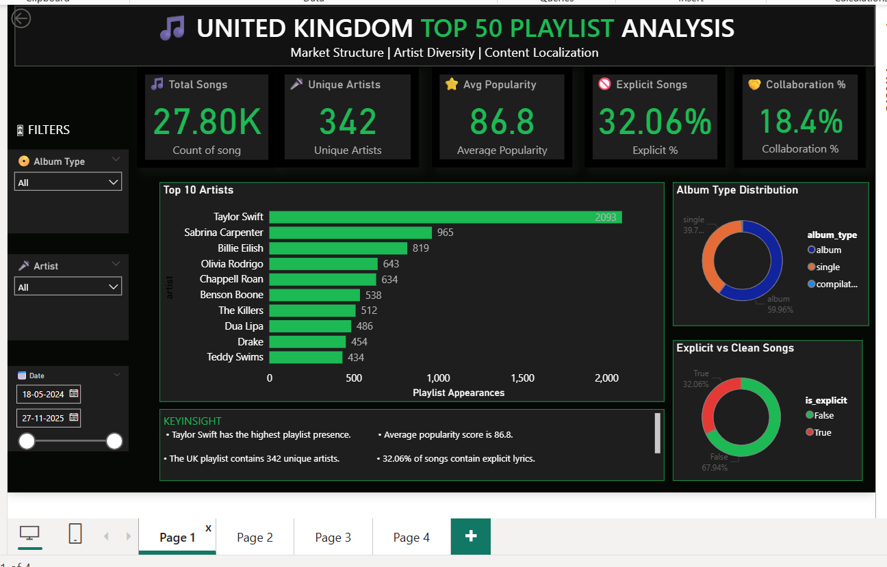
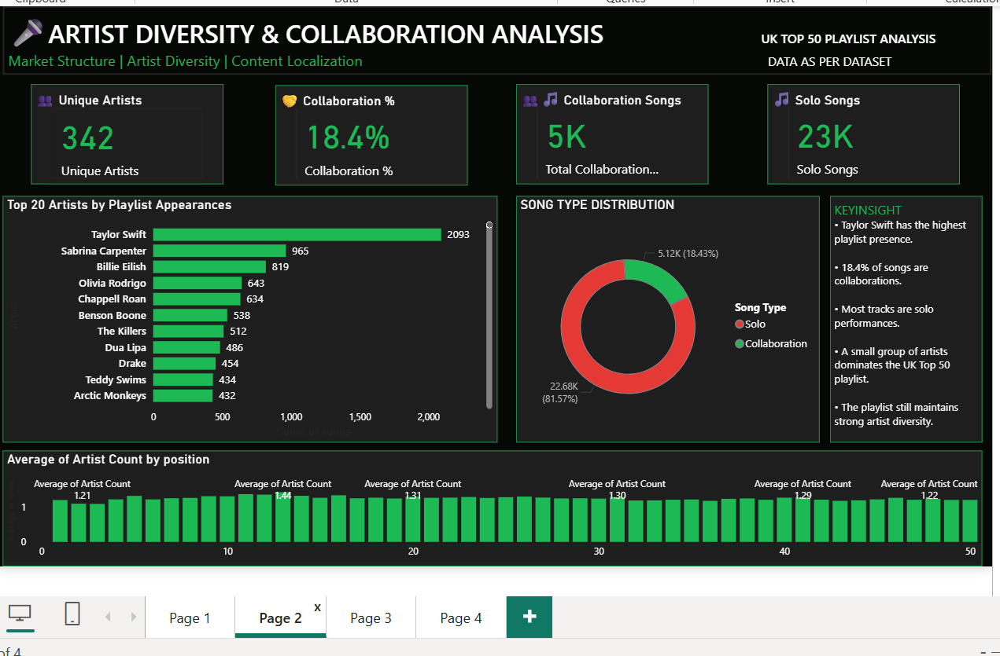
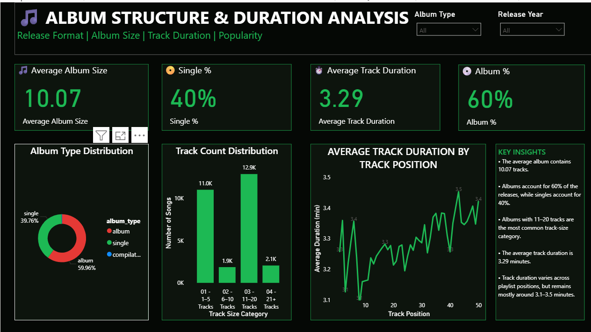
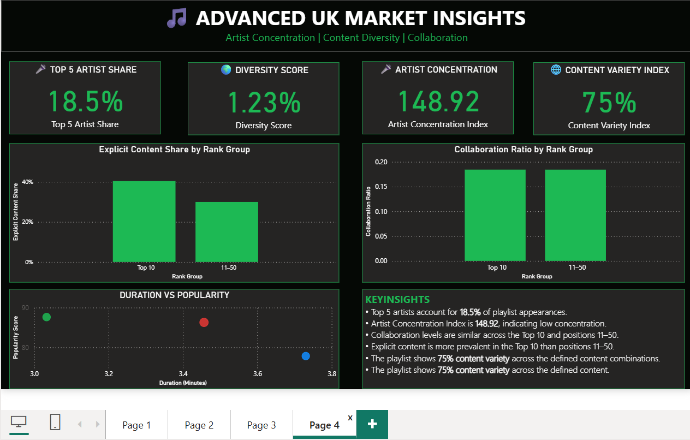

# UK Top 50 Playlist Analysis

## 📌 Project Overview

This project analyzes the United Kingdom Top 50 playlist using Microsoft Power BI.

The main focus is on artist diversity, collaboration patterns, market concentration, album structure, track duration, explicit content, and content variety.

The project contains a four-page interactive dashboard designed to turn playlist data into clear and useful market insights.

---

## 🎯 Project Objectives

- Analyze artist diversity and playlist concentration
- Identify the most frequently appearing artists
- Measure collaboration patterns
- Compare explicit and clean content
- Analyze album vs single representation
- Examine album track-size distribution
- Analyze average track duration by playlist position
- Explore the relationship between track duration and popularity
- Present the findings through an interactive Power BI dashboard

---

## 🛠️ Tools & Technologies

- Microsoft Power BI
- DAX
- Data Cleaning & Transformation
- Data Visualization
- Dashboard Design

---

## 📊 Dashboard Pages

### Page 1 — UK Top 50 Playlist Analysis

- Total Songs
- Unique Artists
- Average Popularity
- Explicit Songs
- Collaboration %
- Top Artists
- Album Type Distribution
- Explicit vs Clean Songs
- Date, Artist and Album Type filters

### Page 2 — Artist Diversity & Collaboration Analysis

- Unique Artists
- Collaboration %
- Collaboration Songs
- Solo Songs
- Top 20 Artists
- Solo vs Collaboration Distribution
- Artist Count by Playlist Position

### Page 3 — Album Structure & Duration Analysis

- Average Album Size
- Single %
- Average Track Duration
- Album %
- Album Type Distribution
- Track Count Distribution
- Average Track Duration by Track Position
- Album Type and Release Year filters

### Page 4 — Advanced UK Market Insights

- Top 5 Artist Share
- Diversity Score
- Artist Concentration Index
- Content Variety Index
- Explicit Content Share by Rank Group
- Collaboration Ratio by Rank Group
- Duration vs Popularity
- Key Market Insights

---

## 📈 Key Results

| Metric | Result |
|---|---:|
| Unique Artists | 342 |
| Collaboration Ratio | 18.4% |
| Top 5 Artist Share | 18.5% |
| Artist Concentration Index | 148.92 |
| Diversity Score | 1.23% |
| Content Variety Index | 75% |
| Average Album Size | 10.07 tracks |
| Album Share | 60% |
| Single Share | 40% |
| Average Track Duration | 3.29 minutes |

---

## 💡 Key Insights

- The Top 5 artists account for 18.5% of playlist appearances.
- The Artist Concentration Index is 148.92, indicating relatively low concentration under the HHI-style measure used in this project.
- Collaborations represent 18.4% of the observed playlist records.
- Albums account for 60% of the observed records, while singles account for 40%.
- The average album size is 10.07 tracks.
- The average track duration is 3.29 minutes.
- Explicit content is more prevalent in the Top 10 than in positions 11–50 in the observed data.
- Collaboration levels are similar between the Top 10 and positions 11–50.

---

## 📸 Dashboard Preview

### Page 1 — UK Top 50 Playlist Analysis

### Page 2 — Artist Diversity & Collaboration Analysis

### Page 3 — Album Structure & Duration Analysis

### Page 4 — Advanced UK Market Insights

---

## 📂 Project Files

- `uk song dashboard.pbix` — Power BI dashboard
- `UK_Top_50_Playlist_Technical_Documentation_Humanized.docx` — Technical documentation
- `screenshots/` — Dashboard screenshots
- `README.md` — Project documentation

---

## 🚀 Future Scope

- Add time-series analysis of playlist changes
- Build an artist collaboration network
- Compare UK and US playlist structures
- Add automated data refresh
- Add more detailed popularity analysis
- Improve collaboration-name detection
- Add additional rank-group analysis

---

## ⚠️ Note

The analysis is based on the available UK Top 50 playlist dataset and its observed playlist snapshots. Metrics such as the Diversity Score and Content Variety Index are project-defined measures and should be interpreted within the context of this analysis.

---

## 👤 Author

**Kshipra Sawwalakhe**

Graduate | Data Analytics Enthusiast
